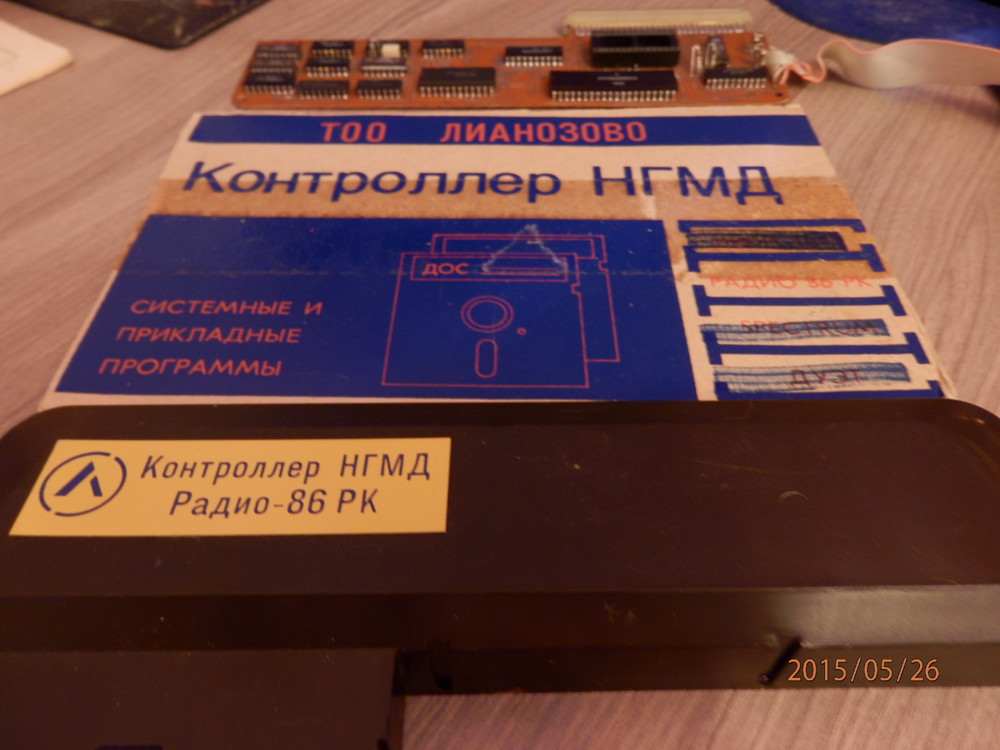
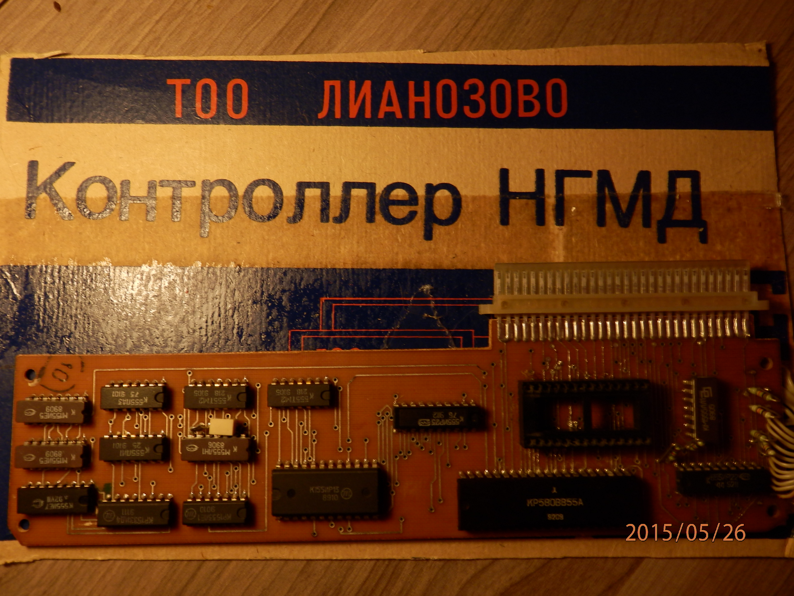
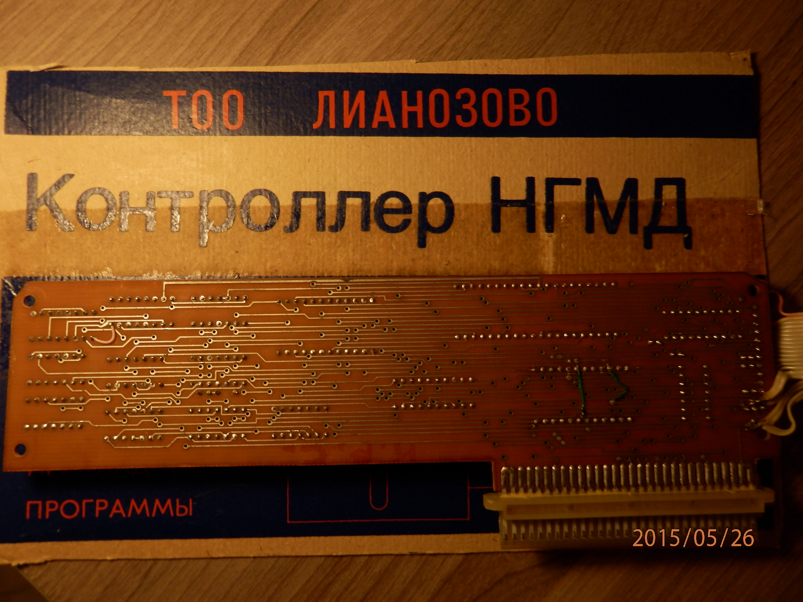

# RKDOS29
## Е. Седов, А. Матвеев.
## Контроллер накопителя на гибких магнитных дисках для «РАДИО-86РК». — Радио, 1993, № 1, 2.

Файл DOS29_0.bin содержит оригинальную прошивку для ДОС 2.9 размером 4кб.

Архив содержит прошику и все команды, в формате записи на магнитной ленте, из каталога TAPE.
Пароль на архив rk86dos29_cy6.rar "zx-pk.ru".

